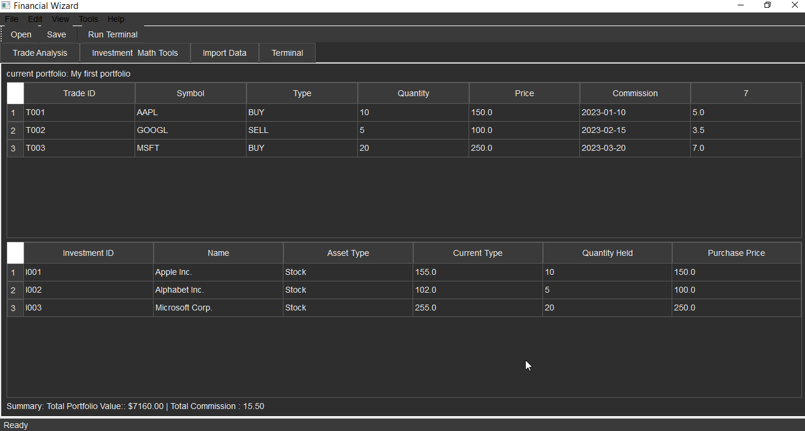
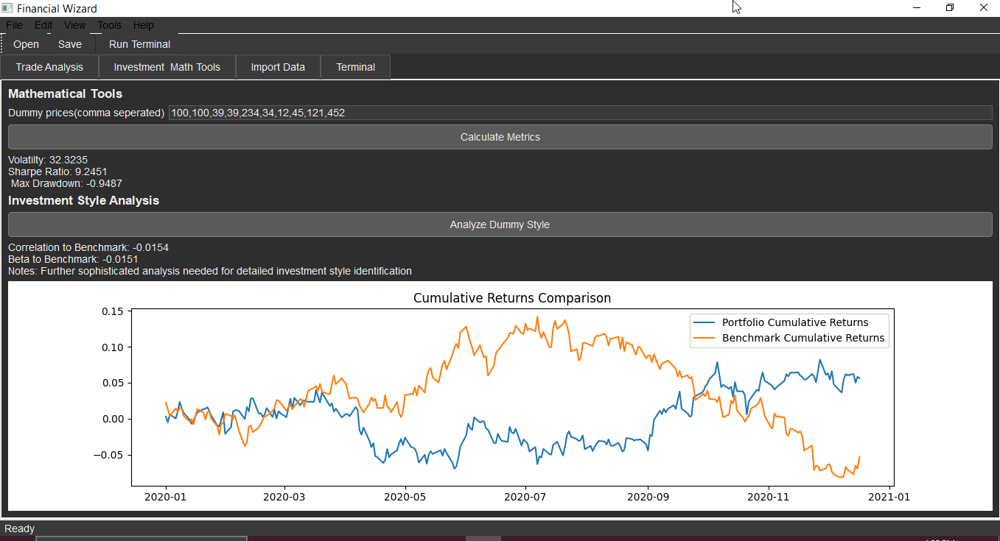

# FinWiz  
Your Financial Wizard Trade Analyzer

## Project Overview

An open-source desktop application for live financial data analysis and custom quantitative research. Built with PySide6, it gives traders, quants, and data scientists a flexible toolkit for building, testing, and refining their strategies — without being locked into a single library or workflow.
With real-time API connections, you can pull market data directly into the app and apply any mathematical technique you like from TA-Lib indicators “on steroids” to advanced statistical models and custom algorithms. It adapts to your workflow — making it as useful for academic exploration as for professional decision-making.

## Architecture Outline

The application will follow a modular architecture to ensure separation of concerns, maintainability, and extensibility. Key modules and their responsibilities are outlined below:

### 1. Core Application (`core/`)
- Entry point of the application, initializes the QApplication and the main window.
- Defines the main application window, including the layout, menu bar, toolbars, and central widget.
- Handles application-wide configurations and settings.

### 2. Data Management (`data/`)
- Defines data structures for trades, investments, and other relevant financial data.
- Module for parsing and extracting data from PDF documents.
- Module for importing and processing data from CSV files.

### 3. Analysis Modules (`analysis/`)
- Contains logic for evaluating individual trades and portfolios.
- Implements algorithms and methodologies for analyzing different investment styles.
- Provides mathematical and statistical functions for financial analysis (e.g., risk metrics, performance indicators).

### 4. User Interface (`ui/`)
- Custom PySide6 widgets used throughout the application.
- Manages application styling, themes (e.g., dark mode), and UI/UX elements.
- Defines various dialogs for user interaction (e.g., file open dialogs, settings dialogs).

### 5. Terminal (`terminal/`)
- Implements the interactive Python terminal interface.
- Handles the sandboxed execution of Python code to ensure security and stability.

### 6. Utilities (`utils/`)
- General utility functions.
- Centralized logging utility.

## Development Environment Setup

1. Create a virtual environment:
   `python3 -m venv venv`
2. Activate the virtual environment:
   `source venv/bin/activate`
3. Install dependencies:
   `pip install -r requirements.txt`

## Running the Application

`python main.py`

## How the inside looks
<p float="left">
  
  
</p>


## Running the Application (Important Notes)

Due to the nature of the sandbox environment, directly running the PySide6 application with a graphical user interface is not fully supported. To run this application, you will need a local environment with a display server (e.g., X11 on Linux, or a standard desktop environment on Windows/macOS).

**Steps to run the application locally:**

1.  **Clone the repository:** (If you were to download this project)
    ```bash
    git clone <repository_url>
    cd FinWiz
    ```
2.  **Create and activate a virtual environment:**
    ```bash
    python3 -m venv venv
    source venv/bin/activate  # On Windows, use `venv\Scripts\activate`
    ```
3.  **Install dependencies:**
    ```bash
    pip install -r requirements.txt
    ```
4.  **Run the application:**
    ```bash
    python main.py
    ```

This will launch the PySide6 desktop application, allowing you to interact with its features, including trade analysis, investment tools, data import, and the integrated Python terminal.


